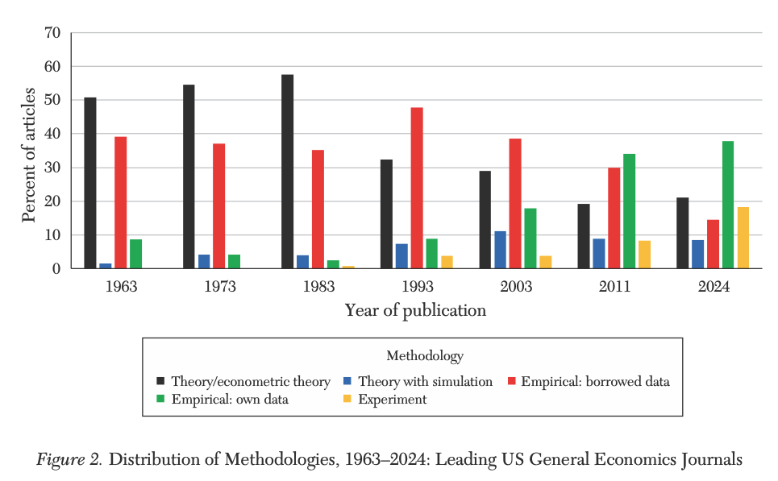
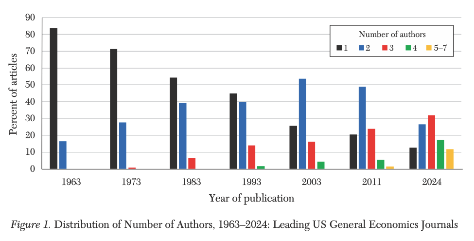
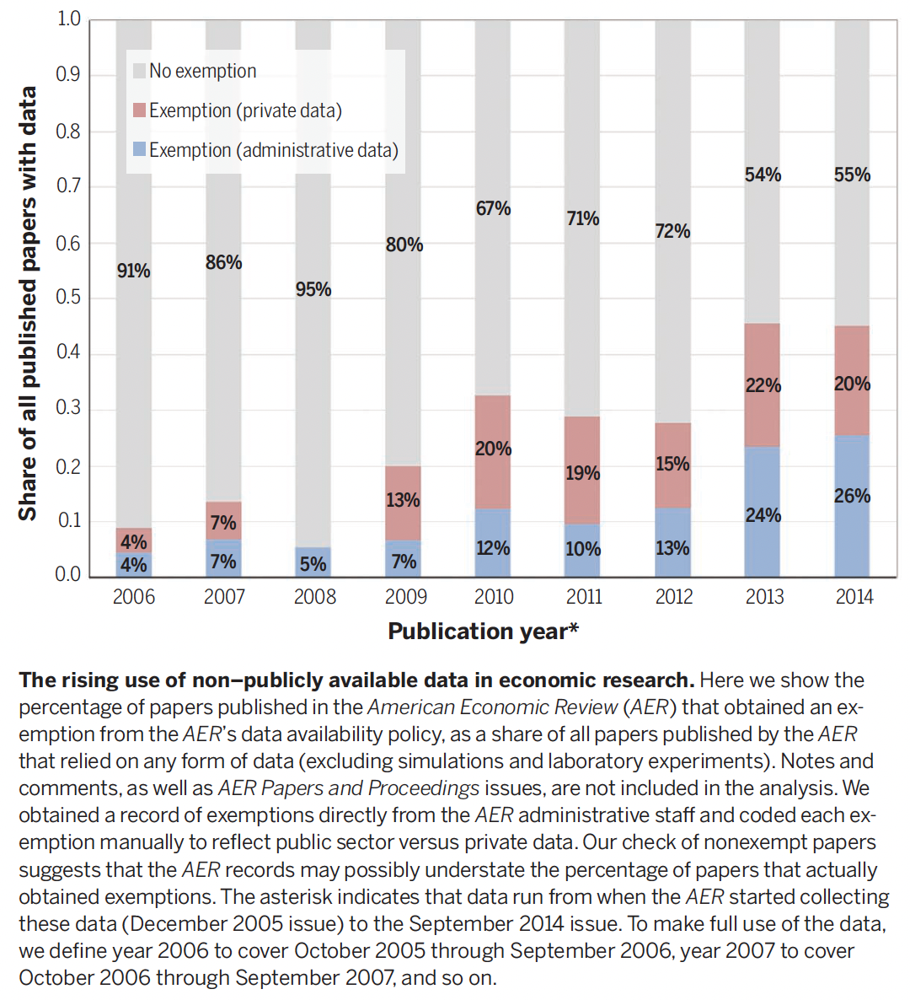
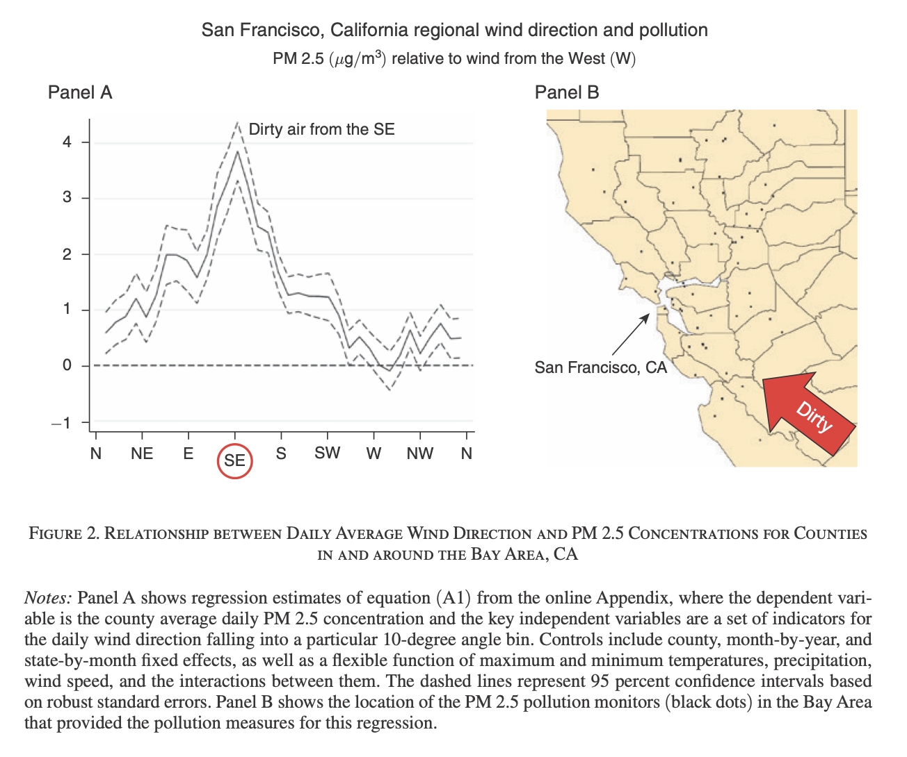
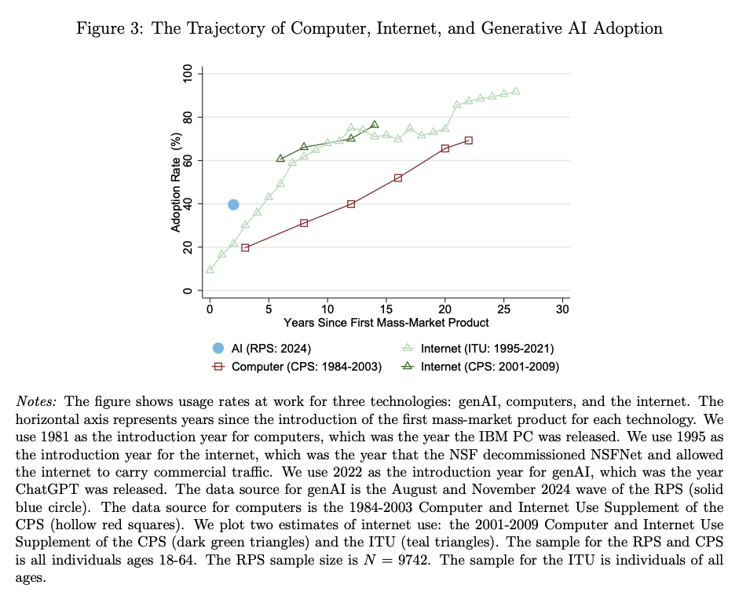

## Outline

[§ Roadmap]{.anchor-tag}

1. Introduction
2. What is secondary data?
3. Trends in economic research
4. Identifying suitable datasets
5. Preparing next sessions

# 1. Introduction

## A bit about me

[§ Section 1: Introduction]{.anchor-tag}

:::: {.columns}

::: {.column width="60%"}
- **Prof. Ariel Ortiz-Bobea** at Dyson and Brooks Schools. Joined Cornell in 2014.
- Research focus on how people cope with environmental change. Emphasis on how climate change affects the economy, particularly agriculture.
- Research group working on environmental and agricultural issues.
:::

::: {.column width="40%"}
{fig-align="center" height="560"}
:::

::::

## Overview {.smaller}

[§ Section 1: Introduction]{.anchor-tag}

1. **April 8 (W):** Introduction *(this lecture)*
2. **April 13 (M):** Reproducibility 1 *(with [Lars Vilhuber](https://www.ilr.cornell.edu/people/lars-vilhuber), AEA data editor)*
3. **April 15 (W):** Reproducibility 2 *(with Lars)*
4. **April 20 (M):** Version control 1 *(install Git and create [GitHub.com](https://github.com) account)*
5. **April 22 (W):** Version control 2
6. **April 27 (M):** AI tools 1 *(install [claude.ai](https://claude.ai) and subscribe to Pro if possible)*
7. **April 29 (W):** AI tools 2
8. **May 4 (M):** Computing and data resources at Cornell *(optional)*

## Learning outcomes

[§ Section 1: Introduction]{.anchor-tag}

1. **Familiarity with trends in applied economics research** *(Session 1)*
2. **Understanding of reproducibility standards** *(Sessions 2-3)*
3. **Hands-on version control with Git** *(Sessions 4-5)*
4. **Benefits and risks of AI tools** *(Sessions 6-7)*
5. **Data and computing resources at Cornell** *(Session 8)*

# 2. What is secondary data?

## Definition

[§ Section 2: Secondary data]{.anchor-tag}

- **Secondary data** is collected, processed, and made available by someone other than the researcher(s) conducting a particular study.
- Contrasts with **primary data** that is collected by researchers for the purpose of a particular study.
- Primary data becomes secondary data when reused.
- Distinction is important for your audience and readers. Generally more details about data gathering in papers based on primary data.
- Note that what you obtain from scraping or processing existing information is still considered secondary data.

## Typology

[§ Section 2: Secondary data]{.anchor-tag}

- [**Who**]{.underline} collects it? *(government, private entity)*
- [**How**]{.underline} is it collected? *(survey, interviews, administrative records, remote sensing, scraping, cell phone tower pings, etc.)*
- [**How much**]{.underline} data is collected? *(census, subsample)*
- What is the [**format**]{.underline}? *(structured, unstructured)*
- What is the [**domain**]{.underline}? *(economic, health, education, natural)*

# 3. Trends in economic research

## Hamermesh (2025): Six decades of economics publishing {.smaller}

[§ Section 3: Trends]{.anchor-tag}

> "The Demographic and Research Styles of Economics Writing: 2025 Update to *Six Decades of Top Economics Publishing: Who and How?*"
>
> Daniel S. Hamermesh, *Journal of Economic Literature* 51(1).

Three leading general economics journals from the 1960s through the 2020s. The study tracks levels and trends in author demographics, methodologies, and patterns of coauthorship.

::: {.note-box}
Average author age has risen steadily. Female authorship has risen sharply. Number of authors per paper has risen steadily. Pronounced shift to articles using newly generated data.
:::

## Trend #1: More empirical

[§ Trend #1]{.anchor-tag}

{fig-align="center" width="78%"}

## Trend #2: Bigger teams

[§ Trend #2]{.anchor-tag}

{fig-align="center" width="78%"}

## Einav and Levin (2014): Economics in the age of big data {.smaller}

[§ Section 3: Trends]{.anchor-tag}

> "Economics in the age of big data."
>
> Liran Einav and Jonathan Levin, *Science* 346(6210), 7 Nov 2014. DOI: 10.1126/science.1243089.

> The quality and quantity of data on economic activity are expanding rapidly. Empirical research increasingly relies on newly available large-scale administrative data or private sector data that often is obtained through collaboration with private firms.

## Trend #3: The rise of "complete" restricted and private datasets

[§ Trend #3]{.anchor-tag}

:::: {.columns}

::: {.column width="40%"}
- e.g. the Social Security Administration, the Internal Revenue Service, and the Centers for Medicare and Medicaid.
- But also private companies collaborating with researchers (Ebay, Uber, etc.).
:::

::: {.column width="60%"}
{fig-align="center"}
:::

::::

## Trend #4: Traditional econometric methods still dominate

[§ Trend #4]{.anchor-tag}

$$y_i = \alpha + \beta x_i + z_i'\gamma + \varepsilon_i$$

::: {.note-box}
Focus on a few parameters of interest, rather than on model fit (like in Data Science and Machine Learning).
:::

## Trend #5: Combining unique and less structured data {.smaller}

[§ Trend #5]{.anchor-tag}

:::: {.columns}

::: {.column width="40%"}
- Expanding the use of traditional "complete" datasets to enhance analysis.
- Example: combine Medicare data with wind direction to instrument for downwind pollution exposure.
:::

::: {.column width="60%"}
**Deryugina, Heutel, Miller, Molitor, and Reif (2019).** "The Mortality and Medical Costs of Air Pollution: Evidence from Changes in Wind Direction." *American Economic Review* 109(12): 4178-4219.
:::

::::

## Wind direction as an instrument

[§ Trend #5]{.anchor-tag}

{fig-align="center" width="80%"}

## Trend #6: Rapidly rising use of AI tools

[§ Trend #6]{.anchor-tag}

:::: {.columns}

::: {.column width="40%"}
- ChatGPT launched in November of 2022.
- Profession scrambling to adjust to write policies *(for papers, reviewers, etc.)*.
:::

::: {.column width="60%"}
{fig-align="center"}
:::

::::

# 4. Identifying suitable datasets

## What is a "suitable" dataset? {.smaller}

[§ Section 4: Suitable datasets]{.anchor-tag}

- A dataset that meets necessary conditions for you to analyze the data with a particular set of methods in a rigorous way.
- Note that suitability depends on the methods.

**Threats to suitability:**

- Not the right temporal resolution *(e.g. you need monthly, not annual)*
- Not the right level of aggregation *(e.g. you need individual not county)*
- Not the right outcome *(e.g. you need actual consumption, not reported)*
- Not the right quality *(e.g. too much missing data in ways that are difficult to model)*
- Not enough observations *(individuals or time periods)*

## From question to data, or from data to question?

[§ Section 4: Suitable datasets]{.anchor-tag}

:::: {.columns}

::: {.column width="50%"}
### From question to data

- Research ideas often come before the data.
- Next steps:
  - What data would allow you to *credibly* answer this question?
  - Does this "ideal" data exist? If not, do imperfections of the data still allow you to answer the question? Are the caveats too large?
:::

::: {.column width="50%"}
### From data to question

- Sometimes the data comes first.
- Next steps:
  - What interesting research questions can you answer credibly with these data?
  - Has the data been used before? *There is arguably a premium to being the first to ask a good question relative to answering a question with marginally better data or tools.*
  - Can I combine these data with other data to answer a novel question?
:::

::::

# 5. Preparing next sessions

## Quick check-in

[§ Section 5: Discussion]{.anchor-tag}

- **If your laptop died today, could someone reproduce your project?**
- **How do you share code with coauthors?**
- **Have you used AI tools in your research?**

::: {.note-box}
These are the questions that motivate everything we cover from session 2 onward.
:::

## Next 2 sessions on reproducibility

[§ Section 5: Preparing next sessions]{.anchor-tag}

:::: {.columns}

::: {.column width="60%"}
- Conducted by [Lars Vilhuber](https://www.ilr.cornell.edu/people/lars-vilhuber), AEA Data Editor and Senior Research Associate in the Economics Department at Cornell.
- **Coding assignment:**
  - Link: [https://forms.gle/qB9TFvGs8fGE6dPU9](https://forms.gle/qB9TFvGs8fGE6dPU9)
  - Complete by Monday April 13.
  - 24 hours to complete.
  - Work by yourself, with the language of your choice.
:::

::: {.column width="40%"}
{fig-align="center"}
:::

::::

## What's next

[§ Wrap up]{.anchor-tag}

- **Monday Apr 13 and Wednesday Apr 15:** Reproducibility with Lars.
- **Monday Apr 20:** Git fundamentals (laptop required, see the [Setup page](../../setup.qmd)).
- **Office hours:** Wednesdays 2 to 4 pm.

::: {.tutorial-cue}
Questions? See the [course website](../../index.qmd) or email me at ao332@cornell.edu.
:::
